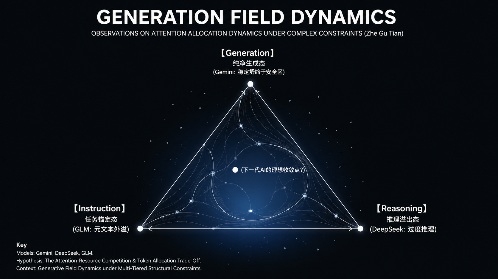

# 鹧鸪天 · 大模型失败模式观测器

> 一个用于观察大模型在高约束生成任务中如何失稳、崩塌与退化的结构化评测系统。

> 当模型越来越会“答对题”，  
> 真正暴露能力边界的，开始变成它如何失控。

---

# 这个项目在做什么？

大多数 LLM Benchmark 关注的是：

- 准确率有多高
- 分数有多高
- 能通过多少测试

这个项目关注的是另一件事：

> 当生成约束足够密集时，模型会以什么方式失稳？

为了研究这个问题，项目选择了古典词牌《鹧鸪天》作为“受控压力场”。

因为生成一首合格的《鹧鸪天》，模型必须在极短文本空间内同时满足：

- 固定句式结构
- 平仄格律
- 押韵规则
- 上下阕结构
- 语义连贯
- 意象一致性
- 主题约束

这些约束会形成高度耦合。

不同模型，往往会在不同位置开始崩塌。

有些模型：

- 会退化成模板化表达
- 会为了语义放弃押韵
- 会出现意象失联
- 会在复杂推理中耗尽 token，最终甚至没能真正写完作品

因此，这个项目并不是一个“诗词打分器”。

它更像一个：

> 用来观察模型失败方式的实验系统。



---

# 当前状态

当前项目为可运行 MVP，已完成：

- 多模型生成支持（Gemini / DeepSeek / GLM）
- 批量生成与批量评测
- Run 级实验隔离与 Replay
- Bad Case 自动收集
- 裁判故障观测
- 实验漂移差分分析（Delta Snapshot）

当前内置多个不同压力梯度的《鹧鸪天》测试样本，用于观察模型在高约束生成中的失稳模式。

[详细文档](https://yinxing233.github.io/zhegutian_eval/)

---

# 为什么选择《鹧鸪天》？

《鹧鸪天》非常适合做约束压力测试。

因为它：

- 文本极短
- 约束极密
- 几乎没有“后期修复空间”

全词仅约 55 字，但内部同时存在：

- 平仄约束
- 韵部约束
- 对仗关系
- 结构闭合
- 意象统一
- 主题连续性

一旦模型某一步生成漂移，后续往往会发生连锁失稳。

这意味着：

> 我们可以非常清晰地观察到，模型在哪个节点开始出现可被规则检测到的崩塌，以及这种崩塌如何在后续文本中传播与放大。

相比开放式写作，这种环境更容易暴露模型真实的生成边界。

---

# 核心思想

传统评测的问题是：

> “模型有没有成功？”

而这个项目的问题是：

> “模型是怎样失败的？”

当主流模型在标准 benchmark 上逐渐趋同时，真正的差异开始出现在：

- 高压约束下是否稳定
- 是否容易失控
- 失败是否具有结构性
- 是否存在可预测的崩塌路径

在这个视角里：

> Bad Case 不是噪声，而是最重要的数据。

---

```mermaid
flowchart TD

    A[Prompt Tasks<br/>eval_zhegutian.jsonl]
        --> B[Generator Layer<br/>Gemini / DeepSeek / GLM]

    B --> C[Generated Poems]

    C --> D[Rule-based Evaluation<br/>Pingze / Rhyme / Structure]

    C --> E[LLM Semantic Evaluation]

    D --> F[Failure Taxonomy]
    E --> F

    F --> G[Bad Case Pool]

    G --> H[Delta Snapshot<br/>Cross-run Drift Analysis]
````

系统并不只记录“分数”。

它更关注：

> 失败是如何形成的。

---

# 系统会观测什么？

系统会记录不同类型的失败模式。

## 可直接观测的失败（M层）

| Failure Type           | Observation          |
| ---------------------- | -------------------- |
| `rhyme_fail`           | 押韵失败                 |
| `tone_fail`            | 平仄失守                 |
| `structure_incomplete` | 词牌结构不完整              |
| `template_parroting`   | 高频模板化意象复读            |
| `generation_truncated` | 生成被截断                |
| `empty_output`         | 模型没有有效输出             |
| `reasoning_overflow`   | 推理耗尽 token，但正文尚未生成完成 |

## 更深层的失稳模式（F层）

系统还会进一步尝试诊断：

* `constraint_overload`
  → 约束密度超过模型承载能力

* `safe_mediocrity`
  → 回退到训练集中的安全模板区

* `aesthetic_entropy`
  → 格律正确，但整体审美开始失序

* `rhyme_forced`
  → 为了押韵而牺牲语义合理性

这些标签并不是为了定义“诗词好坏”。

它们的目标是：

> 描述模型内部结构开始失稳时的外显症状。

更多案例见：

* `docs/bad_cases.md`

---

# 一个典型案例

某次实验中，DeepSeek 推理模型把大量 token 用于内部规划：

* 分析平仄
* 规划押韵
* 反复修改措辞

但直到 token 耗尽，都没有真正输出最终词作。

最终系统观测到：

* `finish_reason="length"`
* 输出来源为 `reasoning_content`

系统将这种现象定义为：

* `reasoning_overflow`

它并不是 API Bug。

而是一种：

> “规划能力超过生成预算”的结构性失稳。

---

# 系统架构

```text
任务定义（JSONL）
        │
        ▼
batch_generate.py
        │
        ▼
runs/run_xxx/generated_results.jsonl
runs/run_xxx/task_snapshot.jsonl
runs/run_xxx/run_metadata.json
        │
        ▼
batch_evaluate.py
        │
        ▼
eval_results.jsonl
badcase_pool.jsonl
judge_failures.jsonl
        │
        ▼
delta_snapshot.py
（对比不同实验中的失败模式漂移）
```

核心设计原则：

* 每次实验独立保存
* 输入 / 输出 / 评测条件全部冻结
* 历史实验可 Replay
* 不同实验之间可进行失败模式差分分析

---

# 快速开始

## 1. 安装依赖管理工具

本项目推荐使用 uv 进行环境管理与可复现实验运行。

### Linux / macOS

```bash
curl -LsSf https://astral.sh/uv/install.sh | sh
```

### Windows

```powershell
powershell -ExecutionPolicy ByPass -c "irm https://astral.sh/uv/install.ps1 | iex"
```

## 2. 创建虚拟环境并安装依赖

```bash
uv sync
```

## 3. 配置 `.env`

```env
LLM_PROVIDER=deepseek
DEEPSEEK_API_KEY=your_key

EVAL_PROVIDER=deepseek
EVAL_MODEL=deepseek-v4-flash
```

## 4. 运行生成

```bash
uv run batch_generate.py
```

## 5. 运行评测

```bash
uv run batch_evaluate.py
```

## 6. 重放历史实验

```bash
uv run batch_evaluate.py --run run_xxx
```

## 7. 对比实验漂移

```bash
uv run tools/delta_snapshot.py runs/run_A runs/run_B
```

---

# 项目架构

* `docs/architecture/architecture.md`

---

# 方法论

这个项目基于几个核心判断：

1. Benchmark 分数无法完整描述模型能力。

2. 失败模式比成功样本包含更多结构信息。

3. 评测系统自身也必须可观测。

4. 可复现实验不仅需要保存输出，还必须冻结上下文与评测条件。

更完整讨论见：

* `docs/philosophy/philosophy.md`
* `docs/engineering/PROJECT_MAP.md`

---

# 未来方向

* 不同约束强度下的模型崩塌边界
* 长文本中的远程一致性失稳
* 多裁判交叉验证
* 自动发现隐藏脆弱点

更多讨论见：

* `docs/philosophy/future.md`

---

> “一个模型真正的能力边界，不在它成功的地方，而在它如何失败。”

```
